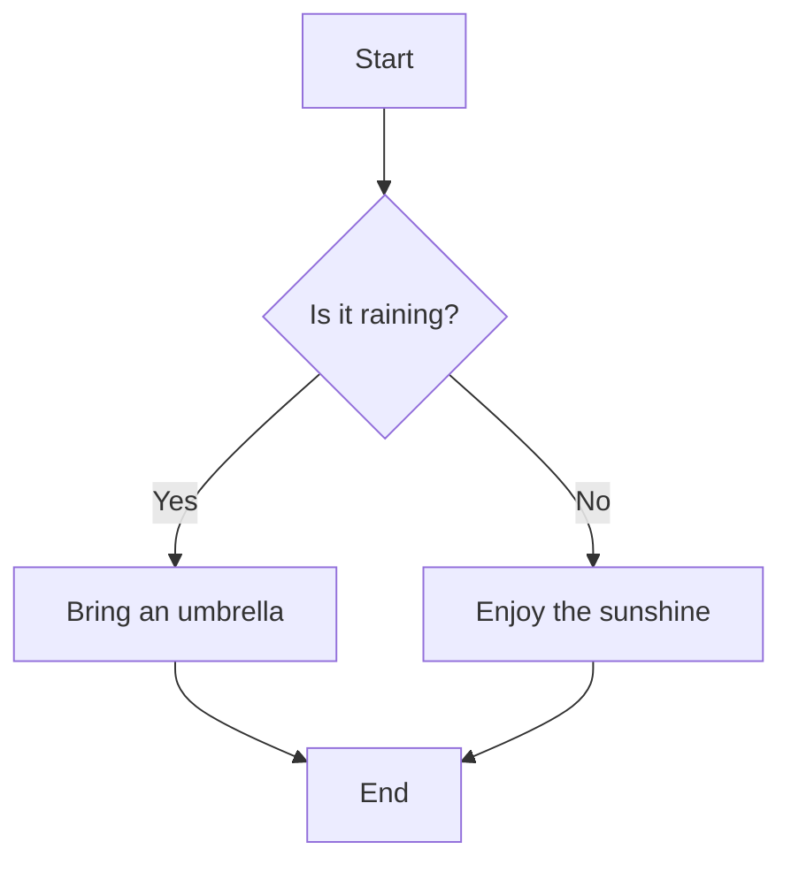

# Obsidian-like Markdown Features Demo

This page demonstrates the Obsidian-like Markdown features now supported in this blog.

## Wiki Links

You can use wiki-style links like this: [[About]] which will link to the About page.

You can also use aliases: [[About|About Me]]

## Callouts

> [!NOTE]
> This is a note callout, similar to Obsidian's callouts.

> [!TIP]
> Here's a helpful tip for you!

> [!WARNING]
> Be careful with this feature.

> [!DANGER]
> This could be dangerous!

> [!INFO]
> Some useful information for you.

## Math Equations

You can use inline math like this: $E = mc^2$

Or block math equations:

$$
\begin{aligned}
\frac{\partial \mathcal{L}}{\partial w} &= \frac{1}{N}\sum_{i=1}^{N}\left(w x_i + b - y_i\right) \cdot x_i \\
\frac{\partial \mathcal{L}}{\partial b} &= \frac{1}{N}\sum_{i=1}^{N}\left(w x_i + b - y_i\right)
\end{aligned}
$$

## Mermaid Diagrams



## GitHub Flavored Markdown

### Task Lists

- [x] Implement wiki links
- [x] Add support for callouts
- [x] Enable math equations
- [x] Support Mermaid diagrams
- [ ] Add more features

### Tables

| Feature | Support | Notes |
|---------|---------|-------|
| Wiki Links | ✅ | Uses remark-wiki-link |
| Callouts | ✅ | Uses remark-callout |
| Math | ✅ | Uses remark-math and rehype-katex |
| Mermaid | ✅ | Uses rehype-mermaid |
| GFM | ✅ | Uses remark-gfm |

### Code Blocks with Syntax Highlighting

```javascript
function hello() {
  console.log("Hello, Obsidian-like Markdown!");
}
```

```python
def fibonacci(n):
    a, b = 0, 1
    for _ in range(n):
        yield a
        a, b = b, a + b
```

## Blockquotes

> Regular blockquotes work too!
> 
> They can span multiple lines.

export default ({ children }) => (
  <div className="w-3/5 mx-auto py-12">
    <article className="prose prose-lg dark:prose-invert">
      {children}
    </article>
  </div>
); 