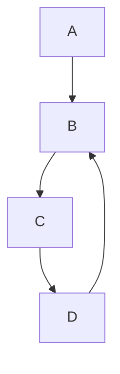
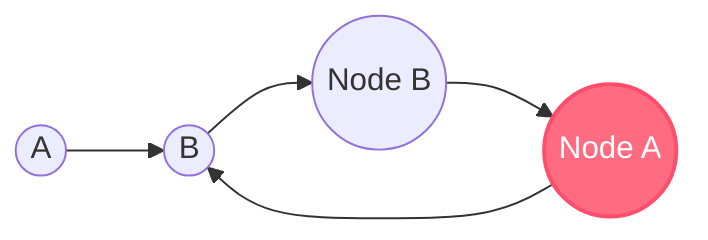

Output is categorical

The output is within a finite set, denote this set $M$

For $m \in M$ we say $m$ is a class or label

Denote some $m_i \in M$ as $1, 2, 3 ..., M$ but note that there *is no* ordering

$M = 2$ is called a binary classification and we use $-1$ and $1$ classes. labels

[[Agile]]


```python
def fibonacci(n):
    a, b = 0, 1
    for _ in range(n):
        yield a
        a, b = b, a + b
```






